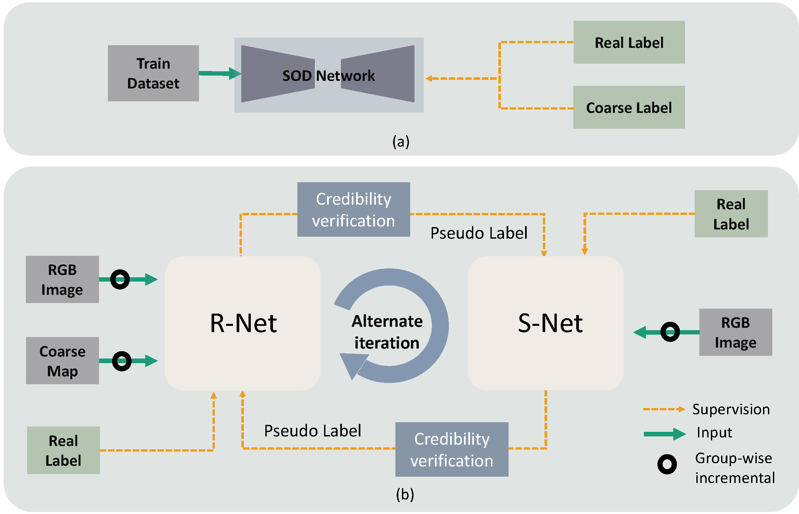
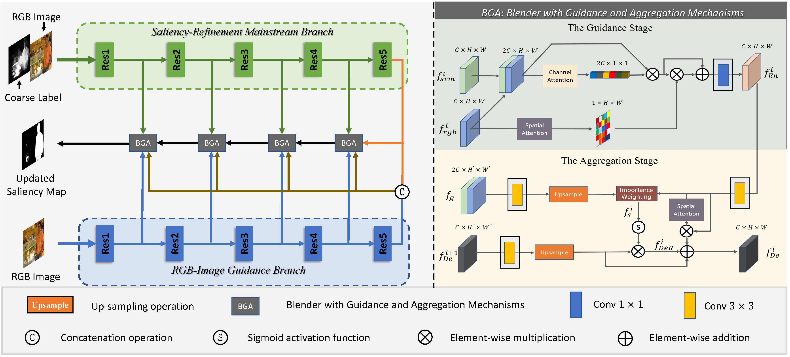
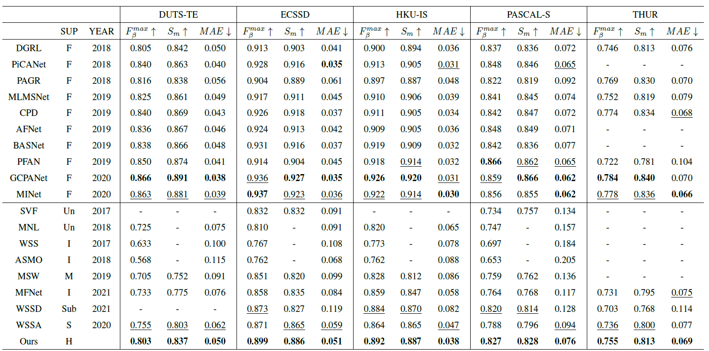

# Hybrid-Label-SOD_TCSVT2022

Runmin Cong, Qi Qin, Chen Zhang, Qiuping Jiang, Shiqi Wang, Yao Zhao, and Sam Kwong, A weakly supervised learning framework for salient object detection via hybrid labels, IEEE Transactions on Circuits and Systems for Video Technology, 2022. In Press.

## Network

### Our overall framework(b)：



### Refine Network




## Requirement

Pleasure configure the environment according to the given version:

- python 3.8.5
- pytorch 1.8.0
- cudatoolkit 11.7
- torchvision 0.9.0
- tensorboardx 2.5.0
- opencv-python 4.4.0.46
- numpy 1.19.2
- timm 0.6.11

We also provide ".yaml" files for conda environment configuration, you can download it from [[Link]](https://pan.baidu.com/s/1vj9_DCUoMukcVVNiXBlb1g), code: mvpl, then use `conda env create -f requirement.yaml` to create a required environment.

## Data Preprocessing

 Please follow the tips to download the processed datasets and pre-trained model:

 1. Download training data  from [[Link](https://pan.baidu.com/s/1rE24g_NCsAoIUrp4bBrr0A)], code: mvpl.
2. Download testing data from [[Link](https://pan.baidu.com/s/1qrU_buTa8LpnE3f0GrDqlQ)], code: mvpl.


```python
├── data
    ├── coarse
    ├── DUTS
    ├── SOD
    ├── dataset.py 
    ├── transform.py
├── data_tset
├── lib
    ├── origin
    ├── CEL.py
    ├── data_prefetcher.py
    ├── LR_Scheduler.py
├── GCF.py
├── net.py
├── test.py
├── train.py
```


## Training and Testing

**Training command** :
Please unzip the training data set to data\DUTS and unzip coarse maps of training data set to data\coarse.
```python
python train.py
```
Tips: Our validation set is 100 images from the SOD dataset.

**Testing command** :
Please unzip the testing data set to data_test.

The trained model for S-Net can be download here: [[Link](https://pan.baidu.com/s/17pz3HVInUS7wnUN2v2s_Yw)], code: mvpl.
```python
python test.py ours\state_final.pt
```
**Tips**: We use Toolkit [[Link](https://github.com/zyjwuyan/SOD_Evaluation_Metrics)] to obtain the test metrics.

## Evaluation
We implement four metrics: MAE(Mean Absolute Error), F-Measure, S-Measure.
We use Toolkit [[Link](https://github.com/zyjwuyan/SOD_Evaluation_Metrics)] to obtain the test metrics.
## Results

1. **Qualitative results**: we provide the saliency maps, you can download them from [[Link](https://pan.baidu.com/s/1yDlwuOgqTKkO3LDXqyfQ2w)], code: 0812.
2. **Quantitative results**: 




## Bibtex
```
   @article{HybridSOD,
     title={A weakly supervised learning framework for salient object detection via hybrid labels},
     author={Cong, Runmin and Qin, Qi and Zhang, Chen and Jiang, Qiuping and Wang, Shiqi and Zhao, Yao and Kwong, Sam },
     journal={IEEE Trans. Circuits Syst. Video Technol. },
     year={early access, doi: 10.1109/TCSVT.2022.3205182},
     publisher={IEEE}
    }
  
```
## Contact Us
If you have any questions, please contact Runmin Cong at [rmcong@bjtu.edu.cn](mailto:rmcong@bjtu.edu.cn) or Qi Qin at [qiqin96@bjtu.edu.cn](mailto:qiqin96@bjtu.edu.cn).

